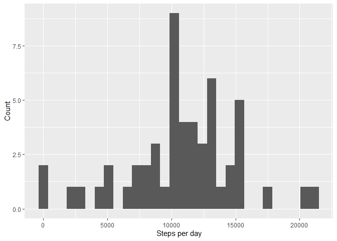
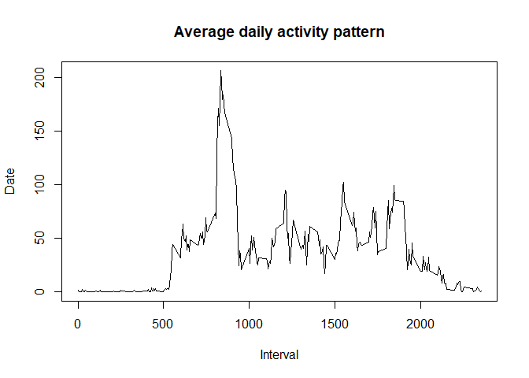
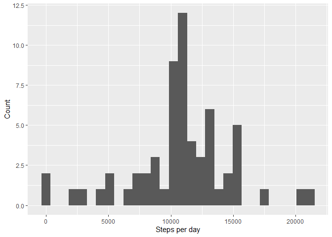
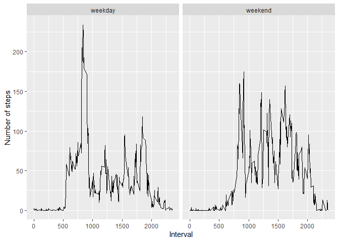

Hello, this is my take on Course Project 1 from the Coursera course Reproducible Research by John Hopkins University.
The template provided by the GitHub repo instructs you to clean/prepare the data once. However, depending on the part of the assignment, it was necessary to include or remove the NA values. Thusly, I chose to repeat the cleaning/preparing process per part. Mind you, the analysis might take a while to process!

## Loading necessary libraries


```r
library(dplyr)
library(ggplot2)
library(tibble)
```

## What is mean total number of steps taken per day?

### Loading and preprocessing the data


```r
activity <- read.csv("./activity.csv")
activity$date <- strptime(activity$date, format="%Y-%m-%d")
```

### Analysis


```r
numberOfStepsPerDay <- activity %>% group_by(date) %>% summarize(stepsperday = sum(steps))

ggplot(data=numberOfStepsPerDay, aes(x = stepsperday)) + 
        geom_histogram() +
        scale_x_continuous(name = "Steps per day") +
        scale_y_continuous(name = "Count")
```

<!-- -->

```r
meanSteps <- mean(numberOfStepsPerDay$stepsperday, na.rm = TRUE)
medianSteps <- median(numberOfStepsPerDay$stepsperday, na.rm = TRUE)

meanSteps
```

```
## [1] 10766.19
```

```r
medianSteps
```

```
## [1] 10765
```

## What is the average daily activity pattern?

### Loading and preprocessing the data


```r
activity <- read.csv("./activity.csv")
activity <- na.omit(activity)
activity$date <- strptime(activity$date, format="%Y-%m-%d")
```

### Analysis


```r
numberOfStepsPerDay <- activity %>% group_by(interval) %>% summarize(stepsperday = mean(steps))

plot(numberOfStepsPerDay$interval, numberOfStepsPerDay$stepsperday,
     main = "Average daily activity pattern",
     ylab = "Date",
     xlab = "Interval",
     type = "l")
```

<!-- -->

```r
index <- which.max(numberOfStepsPerDay$stepsperday)
numberOfStepsPerDay[index, ][1]
```

```
## # A tibble: 1 x 1
##   interval
##      <int>
## 1      835
```

## Imputing missing values

### Loading and preprocessing the data


```r
activity <- read.csv("./activity.csv")
activity$date <- strptime(activity$date, format="%Y-%m-%d")
activity2 <- activity
```

### Analysis


```r
meanStepsPerDay <- activity %>% group_by(date) %>% summarize(stepsperday = mean(steps))
meanStepsOfEveryDay <- mean(meanStepsPerDay$stepsperday, na.rm = TRUE)


numberOfNAs <- sum(is.na(activity))

#Loops through every row of the activity dataframe
for(row in 1:nrow(activity2)){
        #Checks if value is NA. If so, it replaces it with the mean of steps across all days
        if(is.na(activity2[row,][1])){
                activity2[row,][1] <- meanStepsOfEveryDay
        }
}

numberOfStepsPerDay2 <- activity2 %>% group_by(date) %>% summarize(stepsperday = sum(steps))

ggplot(data=numberOfStepsPerDay2, aes(x = stepsperday)) + 
        geom_histogram() +
        scale_x_continuous(name = "Steps per day") +
        scale_y_continuous(name = "Count")
```

<!-- -->

```r
meanSteps <- mean(numberOfStepsPerDay2$stepsperday)
medianSteps <- median(numberOfStepsPerDay2$stepsperday)
meanSteps
```

```
## [1] 10766.19
```

```r
medianSteps
```

```
## [1] 10766.19
```

## Are there differences in activity patterns between weekdays and weekends?

### Loading and preprocessing the data


```r
activity <- read.csv("./activity.csv")
activity$date <- strptime(activity$date, format="%Y-%m-%d")
Sys.setlocale("LC_ALL","English")
```

```
## [1] "LC_COLLATE=English_United States.1252;LC_CTYPE=English_United States.1252;LC_MONETARY=English_United States.1252;LC_NUMERIC=C;LC_TIME=English_United States.1252"
```

### Analysis


```r
activity <- add_column(activity, "weekday")
colnames(activity)[4] <- "weekday"


for(row in 1:nrow(activity)){
        if((weekdays.Date(activity[row,][2]) == "Saturday") || (weekdays.Date(activity[row,][2]) == "Sunday")){
                activity[row,][4] <- "weekend"
        }
}

numberOfStepsPerDay <- activity %>% group_by(weekday, interval) %>% summarize(stepsperday = mean(steps, na.rm = TRUE))

qplot(interval, stepsperday , data = numberOfStepsPerDay, facets = .~ weekday, 
      ylab = "Number of steps",
      xlab = "Interval",
      geom = "path")
```

<!-- -->
